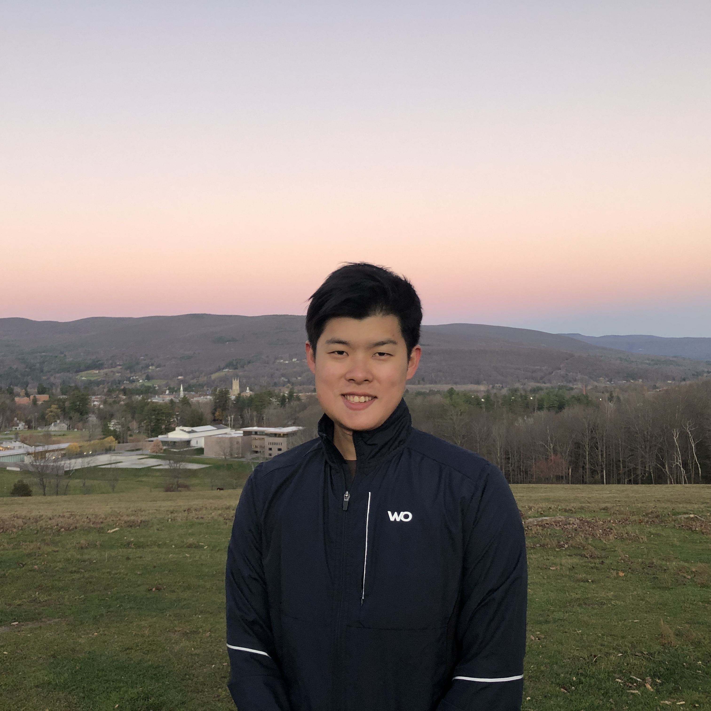

{width=320 fig-align="left"}

I am an incoming PhD student in Economics at George Washington University.

My research interests are in applied microeconomics, development economics, and labor economics.

Before beginning my PhD, I worked at Charles River Associates in Boston. I received my B.A. in Economics and German from Williams College. 

## Contact

Email: ken.morotomi [at] gwu [dot] edu